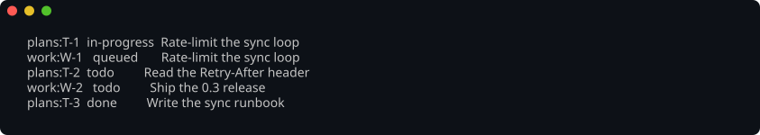
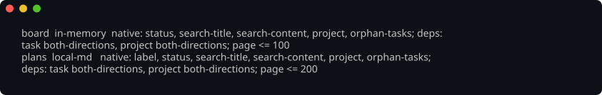

# onetaskgraph



One interface over the ticketing systems your work actually lives in.

Every image in this README is a real capture of this CLI's output, produced by running the
binary against a small fixture and refused by CI the moment its bytes stop matching what
the binary prints — so the pictures cannot drift away from the tool.

Tasks, projects, labels and the dependencies between them are spread across Linear, GitHub
Projects and a folder of Markdown files, and every tool that wants to reach them ends up
reimplementing all three. `onetaskgraph` implements them once, behind a single query
surface: a command-line tool, the Rust engine crate's library API, and SDKs for Python and
TypeScript. Every consumer reaches the same engine, so their query semantics cannot drift.

Two properties make it different from a lowest-common-denominator wrapper:

- **A rich source is not reduced to a poor one's floor.** Each source declares what it can
  do natively. The engine pushes those predicates down and compensates in memory for the
  rest — and every response carries the plan it ran, so `--explain` shows you which source
  filtered server-side and which one the engine narrowed for.
- **Nothing of your work is kept outside the system that owns it.** No cache, no index,
  no local mirror. The engine holds at most one source page at a time and writes nothing
  down — enforced by a supply-chain gate that refuses every embedded store and cache
  crate, a sandboxed journey that fails if any file written during a run contains your
  data, and an assertion that the same query asked twice reaches the source twice.

  `copy` is not an exception to that, and the difference is worth stating plainly. A
  destination write is at your explicit request, names its destination, goes through that
  source's own write interface into that source's own store, and is never read back to
  answer a query. A cache is a write nobody asked for that the engine reads back. Copying
  a task into a folder of Markdown puts it in the plugin that now owns it; nothing is
  kept anywhere else, and the sandboxed journey above drives `copy` and fails, naming the
  path, if any file outside that destination's own store changes.

> **Status.** The plugin contract, the workspace, the gate, the configuration layer and the
> query engine are in place, and the binary answers every verb below. The three sources
> this product ships for your work — `local-md`, `linear` and `github-projects` — can all
> be read and written; none is read-only. A copy can still refuse a configured destination
> with no write side, such as a subprocess source whose capability handshake declares no
> writes, but that is a property of that configured source rather than of these plugins.

## Using it

Each source says what it can do, and `sources list` is where you read that back: the
predicates it applies itself, how far it walks dependencies, and the largest page it will
serve.



```bash
onetaskgraph sources list
onetaskgraph sources fields <SOURCE> [--apply] [--json]
# Without --apply this only reports what a GitHub Projects board lacks of the fields its
# source's configuration names: the Status options status_mapping resolves to, and the
# Priority field and its options when priority_mapping is set. --apply adds the missing
# options and creates a missing Priority field, sending every existing option back with its
# id, then verifies every pre-existing option and every item's values of both fields and
# prints recovery data if GitHub drifted; a status name is reported missing for each item kind
# that names it. For a Linear source it reports every name its status_mapping gives a task
# against the team's workflow states, and every name it gives a project against the
# workspace's project statuses, each present with its type or missing; --apply creates each
# missing one first, of the type its category derives, and renames, retypes or deletes nothing.
# See "Status mapping" below.
onetaskgraph sources status-options <SOURCE> [--apply] [--json]
# The Status-only form of `sources fields`, which supersedes it; kept as it was.
onetaskgraph sources route <SOURCE> [--repository R]... [--json]
# Where an item with these repositories, written to SOURCE, would land by its routes —
# read from configuration alone, never from a source. See "Routing" below.

onetaskgraph task list [--source S]... [--label L]... [--not-label L]...
                       [--status S]... [--priority none|urgent|high|medium|low]...
                       [--project P [--members] | --no-project] [--commented-since RFC3339]
                       [--metadata KEY[/SEGMENT...]=VALUE]... [--origin SOURCE:ID]
                       [--search TEXT] [--in title|content|both]
                       [--limit N] [--page TOKEN] [--explain] [--allow-partial] [--json]
onetaskgraph task show <ID> [--no-comments]
onetaskgraph task show-many <ID>... [--no-comments]
onetaskgraph task deps <ID> [--direction depends-on|depended-on-by]
onetaskgraph task copy <ID>... --to <SOURCE> [--match-by KEY] [--recreate] [--create] [--dry-run]
onetaskgraph task comment add    <ID> [--body-file PATH] [--author NAME]
onetaskgraph task comment list   <ID>
onetaskgraph task comment edit   <ID> <COMMENT-ID> [--body-file PATH]
onetaskgraph task comment delete <ID> <COMMENT-ID>
onetaskgraph task status set <ID> draft|backlog|todo|queued|in-progress|done|cancelled|unknown
onetaskgraph task priority set <ID> none|urgent|high|medium|low
onetaskgraph task content set <ID> --file PATH
onetaskgraph task metadata set <ID> <KEY> <VALUE>
onetaskgraph task update <ID> [--title TITLE] [--body-file PATH]
                         [--status CATEGORY [--status-name NAME]] [--priority PRIORITY]
                         [--metadata KEY=JSON]... [--remove-metadata KEY]...
                         [--delivers ID... | --no-delivers] [--depends-on ID... | --no-depends-on]
onetaskgraph task create <SOURCE> --project P --title TITLE
                         [--template FILE [--search-path DIR]... | --template-loader FILE
                          | --body-file PATH]      # none of the three: the body on stdin
                         [--answers FILE] [--var NAME=VALUE]... [--status CATEGORY]
                         [--label L]... [--repository R]... [--depends-on ID]...
                         [--delivers ID]... [--metadata KEY=JSON]...
onetaskgraph task render <ID> [--template FILE | --template-loader FILE] [--search-path DIR]...
                         [--answers FILE] [--var NAME=VALUE]... [--unset NAME]... [--dry-run]
onetaskgraph task answers <ID>

onetaskgraph project list / show / deps          # the same flags, minus the project filter
onetaskgraph project copy <ID> --to <SOURCE> [--no-tasks | --member TASK-ID...]
                                                 [--match-by KEY] [--recreate] [--dry-run]
onetaskgraph project metadata set <ID> <KEY> <VALUE>

onetaskgraph document list / show                # the same flags, minus --status
onetaskgraph document copy <ID>... --to <SOURCE> [--match-by KEY] [--recreate] [--dry-run]
onetaskgraph document metadata set <ID> <KEY> <VALUE>
onetaskgraph document create <SOURCE> --project P --title TITLE [--id DOC]
                             ...                 # the body, label, repository and metadata
                                                 # flags of `task create`
onetaskgraph document render <ID> ...            # the flags of `task render`
onetaskgraph document answers <ID>

onetaskgraph label list [--source S]...
onetaskgraph search <TEXT> [--in ...] [--kind task|project|both]

onetaskgraph template variables <FILE> [--search-path DIR]... | --template-loader FILE
onetaskgraph template render <FILE> [--search-path DIR]... | --template-loader FILE
                             [--answers FILE] [--var NAME=VALUE]...

onetaskgraph config show                         # every setting and the layer it came from
onetaskgraph schema                              # the JSON Schema bundle both SDKs use
```

An `<ID>` is qualified: `work:ENG-142`. Repeating `--label` narrows — a second one is a
second requirement — and `--not-label` excludes. `--project` takes a qualified id, which
narrows the query to that project's own source, or a bare native id, which is asked of
every selected source.

A **document** is what lives in a project and is not work — a design note, a runbook, a
page somebody has to read. It carries no status and takes part in no dependency graph, so
`document` has no `--status` filter and no `deps` verb. What it does carry is a
**location**: where a reader can actually open it, as a link (`url …`) or as an absolute
path on the machine its source runs on (`path …`). `task show`, `project show` and
`document show` all print it, and `--json` carries the contract type's own shape —
`{"url": …}` or `{"path": …}` — so a program branches on which key is present. Not every
source has documents; one that says it has none is reported as holding none rather than as
having failed, and a copy naming it is refused before anything is read.

A **comment** is added to a task after the task exists, without rewriting it — evidence
appended to an issue somebody else opened. `task comment add` and `edit` read the body from
`--body-file`, or from standard input when that flag is absent, and never from a word of the
command line, so a body quoting a command never passes through a shell; it is stored and
returned byte for byte, and an empty one is refused. `--author` is for a source that records
what it is given, such as a folder of Markdown; GitHub and Linear record the signed-in
account themselves and refuse it rather than drop it. `task show` prints a task's comments
after its body, and its `--json` carries them as a top-level `comments` list for a source
whose tasks have comments — absent, rather than empty, for one whose tasks have none. A
`task copy`, `project copy` or `document copy` never reads or writes a comment at either end.

`task show-many <ID>...` shows several tasks at once, whatever sources they are in, and its
`--json` is `{"details": [...]}`: one entry per id, in the order given, each exactly what
`task show <ID> --json` prints. An id that cannot be read — no such task, no such source, a
GitHub draft's comments — carries its failure in that entry's own `errors` and does not refuse
the others; the command exits non-zero exactly when some entry carries one. Each source is
asked for its ids together, so GitHub Projects reads 24 items, with their comments, per
request.

`task list --commented-since <INSTANT>` keeps the tasks **one of whose comments was created,
or last edited, at or after** the instant — an RFC 3339 time with its offset, such as
`2026-09-28T12:00:00Z`; one without an offset is refused, naming the flag. A task with no
comments never matches, and a comment deleted before the query is not a match. It combines
with every other filter, and the answer is exactly their intersection. A folder of Markdown,
an in-memory source and a GitHub Projects board apply it themselves. A board asks GitHub's
issue search, scoped by the board alone, for the issues updated since the instant, then reads
those candidates' comments and no others' — exact for new and for edited comments in every
repository the board's items live in, because GitHub moves an issue's `updatedAt` when one of
its comments is added or edited, which the board's credentialed journey re-takes on every
run. That search is an index that lags a write by a second or two, so when you ask again from
the time you last asked, overlap the two instants by more than that. Linear asks for the
issues with a comment created or last edited at or after the instant, by the same two times a
comment read reports. A source that does not apply it itself is narrowed by the engine, which
**reads that source's comments task by task** for every task the other filters kept: correct,
and as costly as that sounds on a large workspace.

`task list --metadata <KEY>[/<SEGMENT>…]=<VALUE>` keeps the tasks whose caller-defined
metadata holds the string `VALUE` at that location. `/` splits the top-level key — which may
itself contain dots, such as `orchestrator.follow-up` — from the nested object keys under it,
and the first `=` splits the location from the value, so
`--metadata orchestrator.follow-up/root_cause=stale-cache` keeps the tasks whose
`orchestrator.follow-up` object holds `root_cause: "stale-cache"`. The value there must be a
string equal to `VALUE`, case-sensitively. Repeat the flag and a task is kept only when it
holds every one. `task list --origin <SOURCE>:<ID>` keeps the tasks copied from that item:
those whose `onetaskgraph.origin` is exactly that qualified id — never one it only begins or
ends with. A folder of Markdown and an in-memory source apply both themselves; Linear asks for
the issues whose description holds each value as its metadata slot spells it and confirms every
one over the parsed slot; a source that applies neither is narrowed by the engine over each
task's own metadata.

A GitHub Projects board answers `--search`, `--metadata` and `--origin` **without listing the
board**, which is what keeps a large board affordable:

- `--search` is one board-scoped issue search for the text as a phrase, in the title, the body
  or both as `--in` says, and every candidate is confirmed by the same case-insensitive
  substring rule a folder of Markdown uses — so every task returned contains the text. GitHub
  matches whole words, so a task holding the text only inside a longer word (`ship` inside
  `Shipment`) is **not** returned: that is this source's declared behaviour, not a defect.
- `--metadata` is the same search with each value as a phrase in the body — GitHub indexes the
  metadata comment a board keeps at the end of each issue body — and every candidate is
  confirmed against that parsed comment.
- `--origin` is the board's own field filter on its `onetaskgraph.origin` field, which finds
  every carrier whichever release wrote it, together with the issue search for the id in the
  body, where a write mirrors it so a copy another process made seconds ago is found too.
  Every candidate is confirmed against the origin field, which is the one place a board's
  origin is read from.

Every answer is completed with what the same command has just written, so a task written a
moment ago is found. A task **another** process wrote moments ago may be missing until GitHub
indexes it — usually a second or two, and for a task whose origin is in the field alone, as
long as the board's own item list is behind on it, which can be minutes. A board **draft** is
not an issue and is never returned by any of the three. Labels, status, priority and project
are confirmed over the candidates, and a query carrying none of the three reads the board as
before.

`project list --search`, and `document list --search` without `--project P` — `--no-project`
included — are the same board-scoped search, each candidate confirmed by its kind and by the
substring rule, and narrow the same way: whole words only, so `ship` does not find a project
titled `Shipment plan`, and no board draft — a draft titled as a design document included — is
ever returned. A text with no letter or digit, such as `--`, is refused there before anything
is sent. `document list --project P --search` sends no search: it reads that project's
sub-issues and matches the text inside words too, as before.


A task's **status** is set on its own with `task status set`, which writes that one field —
title, body, labels, metadata, dependencies and comments stay exactly as they are — and
answers with the status as the source reads it back. `queued` is the category for work
claimed by something that will do it and not yet started, between `todo` (ready, and nothing
has claimed it) and `in-progress`. A folder of Markdown reads the word `queued`; a GitHub
Projects board sends it to its `Queued` column by default, `status_mapping.queued` naming
another; Linear writes it as the name its source's `status_mapping.queued` gives the item's
kind, and refuses it by name when that source gives none. See "Status mapping" below.

<!-- llmlint: ignore[contracts_have_one_source_or_a_drift_gate] This user-facing summary is required to describe the GitHub projection; the loopback plugin tests and shared live journey drive the resolved mapping, mutations, and observed read-back together. -->
On GitHub Projects, terminal writes keep both GitHub representations aligned: `done`
selects the mapped `Done` option and closes the issue as completed, while `cancelled`
selects the mapped `Cancelled` option and closes it as not planned. Those are the shipped
option names. An open-category write reopens a closed issue before selecting its mapped
option; a draft item has no issue state to reopen. If any mapped option is absent, the
write is refused by that option's name before either representation changes —
`sources fields` (and its Status-only form, `sources status-options`) counts a terminal
category's mapped option as configured, so it names a missing `Done` or `Cancelled` and
`--apply` adds it. Reads keep
GitHub's issue decision authoritative for closed issues—completed reads `done` and not
planned reads `cancelled`, regardless of the displayed option—while the Status option
decides an open issue's category.

A task's **priority** is one of `none`, `urgent`, `high`, `medium` and `low`, and every task
carries one — `none` when none is set, and for every task of a source that cannot hold one.
`task list --priority` keeps the tasks at any of the priorities named, and `task priority set`
writes that one field and answers with the priority as the source reads it back; `none`
clears it. A copy carries a task's priority like its status. A folder of Markdown holds it as
a `priority:` key, Linear as its own issue priority, and a GitHub Projects board as the
option of a single-select `Priority` field that the source's `priority_mapping` names —
`Urgent`, `High`, `Medium` and `Low` unless it says otherwise. A board source configured
without `priority_mapping` holds no priority, and a copy or a `task priority set` that would
write one to it is refused by name before the board is asked anything. `sources fields
<SOURCE> --apply` creates the board's `Priority` field, or adds the options it lacks, without
disturbing an option or an item's value that is already there.

A task's **content** is replaced on its own with `task content set <ID> --file PATH`: the
file's bytes become the task's body, and status, priority, metadata, labels, repositories and
dependencies stay exactly as they are — on a GitHub board, whose metadata lives in the issue
body beside the content, that block is kept as it was. There is no compare-and-set: what the
file holds replaces whatever the task held.

One **metadata** key of a task, a project or a document is set on its own with `task`,
`project` or `document metadata set <ID> <KEY> <VALUE>`, which adds the key or replaces what
it holds and changes nothing else about the record — every other key, and every other field,
stays exactly as it was, and a key already holding the value is not written at all. `KEY` is
your own dotted `<namespace>.<name>`: two or more non-empty segments, never in the
`onetaskgraph.` namespace this product keeps in step itself. `VALUE` is exactly one JSON
value, parsed as JSON and never as YAML, so a bare `yes` or `2026-01-01` is refused rather
than given a type — quote a string as `'"text"'`. An unqualified id, a key or a value of
those shapes is refused before any source is asked. The answer — `MetadataSet` under
`--json` — carries the id, the key, the value as the source reads it back after the write,
and the record's location. Metadata is not status, so no task it delivers is re-evaluated.
A folder of Markdown edits the one entry of its `metadata:` block and no other byte, and
refuses by name a block it cannot edit that narrowly; a GitHub Projects board sends one
update of the issue body that changes only its metadata slot; the in-memory source holds the
value for the life of its process; and Linear sends one update of the issue's or the
project's description, or the document's content, that changes only the metadata slot at its
end. A source with no
write side, a record the source does not hold, and a stdio plugin whose handshake does not
declare the write are each refused by name.

Several fields of one task are **updated** together with `task update <ID>`, which writes
every field it names and nothing else: `--title`, the content from `--body-file`, `--status`
(and `--status-name`, the status's own word where the source keeps one), `--priority`, any
number of `--metadata KEY=JSON` to set and `--remove-metadata KEY` to remove, and
`--delivers` or `--depends-on` lists that replace the task's own, their `--no-…` forms
replacing them with none. A field that already holds the value named is not written, and an
update in which nothing differs writes nothing at all; the answer — `TaskUpdated` under
`--json` — says which fields were written, carries the task as its source reads it back, and
under `spent` what the source's own meter says the call cost. Labels, repositories and the
project a task is filed under are not among the fields: an existing item is never moved. On a
GitHub Projects board that is at most one read of the issue, one `updateIssue` carrying the
title, the body — visible content and metadata block together — and any state change, one
field write each for `Status` and `Priority`, and only the `blockedBy` edges that differ;
Linear sends one `issueUpdate` of what differs, and a folder of Markdown replaces the file
once, every byte it was not asked to change kept. Naming a status or a `delivers` list keeps
every delivered task in step exactly as `task status set` does, and exits `4` when one could
not be; naming neither re-evaluates nothing. A key both set and removed is refused before
anything is written, and so is an update naming no field.

A task can name the tasks it **delivers**: finishing it finishes them. In a folder of
Markdown that is a `delivers:` list in the front matter — a bare id names a task of the same
folder and `<source>:<id>` a task anywhere — and on a GitHub board it is the
`onetaskgraph.delivers` key of the issue's metadata block. The delivered task's
`delivered_by` is onetaskgraph's to keep. Whenever it writes a task that delivers anything,
or delivered something before — a copy, `task status set` or `task update` — each delivered
task gains the deliverer's qualified id, a task it dropped loses it, and the delivered task's
status follows its deliverers while it is at `todo`, `queued` or `in-progress`:
`in-progress` while any runs, `queued` while any is queued, `done` once every one is done or
cancelled and at least one is done, and `todo` when they release it. A delivered task at `draft`, `backlog`, `unknown`,
`done` or `cancelled` is left alone, a deliverer its source no longer holds is dropped from
`delivered_by`, and a delivered task that cannot be read or written is reported failed while
the deliverer's own write stands.
A copy rewrites a `delivers` entry naming another item it copies to that item's new id,
counts those under `delivers_rewritten`, and never carries `delivered_by`. Every verb that
writes a deliverer reports each delivered task it evaluated under `delivered`. A `--dry-run`
copy writes nothing and so keeps no delivered task in step: its `delivered` list is empty,
which says nothing about whether a delivered task would have moved.

How a source *spells* a document is its own business. A GitHub Projects board has no
document type, so `github-projects` reads one as an ordinary issue whose title begins
`DESIGN: ` — the title you see has that prefix taken off, and writing a document puts it
back, so a design note copied out of a board and back returns the title it started with.
`docs/metadata.md` records the whole of that rule.

### Seeing which plan you got

`--explain` renders the plan the query ran, per source. Here one `--label` query reaches
two sources of differing capability — a folder of Markdown, and a source that declares it
cannot filter by label at all:


The folder filtered the rows itself; the other source returned the wider set and the engine
narrowed it. One query, two plans, and the same correct answer either way — which is what
the capability declaration above buys you and why it is worth reading. `--json` carries the
same plan as a field, so a script does not have to parse the prose.

### Writing tasks: Markdown in, ticket out

Authoring against a ticketing API is not something a person or an agent does well, and a
folder of Markdown files is. So that is how work is created here: write the files, read
them back through the CLI to be sure they parse, then copy them where your team works.

With `notes` configured as a `local-md` source rooted at `./notes`, create its task folder
and write `notes/tasks/rate-limit.md`:

```markdown
---
title: Rate-limit the sync loop
status: Todo
labels: [{id: local-reliability, name: reliability}]
metadata: {onepipeline.turn_budget: 12}
repositories: [github.com/acme/sync]
---
Back off when the API asks us to slow down.
```

Read it through the CLI before writing to the permanent `linear` destination, then copy
the qualified id the read returned:

```console
$ onetaskgraph task list --source notes
notes:rate-limit  todo  Rate-limit the sync loop
$ onetaskgraph task copy notes:rate-limit --to linear
```

The read is intentional: a malformed front matter block caught in a local file is cheaper
to fix than a parse failure first discovered while writing to somebody's ticketing system.
Projects use the same flow under `notes/projects/`, followed by `project list` and
`project copy`.

Editing is the same road in reverse — copy out, edit, copy back:

```console
$ onetaskgraph task copy work:T-1 --to notes
$ grep -A2 '^metadata:' notes/tasks/T-1.md
metadata:
  onetaskgraph.origin: work:T-1
$ $EDITOR notes/tasks/T-1.md
$ onetaskgraph task copy notes:T-1 --to work
```

<!-- llmlint: ignore-block[contracts_have_one_source_or_a_drift_gate] Held by the journeys
     in `crates/onetaskgraph/tests/e2e/copy_link.rs`: one fails unless the link example below is
     the link a copy of `T-1` into `notes` really records, and another fails unless the rule for
     a link naming nothing names the failure kind the binary really reports. -->
The copy back **updates** rather than duplicating because the copied file carries the id
it came from, under the reserved metadata key `onetaskgraph.origin`. The item it was copied
*from* records where it landed too, under `onetaskgraph.copies` — an object naming the
counterpart at each destination it was copied into, such as
`{"notes": "notes:T-1"}`. Nothing anywhere holds a mapping: the correspondence lives on the
two items, inside the plugins that own them.

These rules find the counterpart, in this order:

1. **The link.** If the item's `onetaskgraph.copies` names an item at the destination, that
   item is read by id, and when its own origin names the item being copied it is the
   counterpart and the copy updates it — one read, and no search of the destination. If it
   names an item the destination no longer holds, the copy refuses with the failure kind
   `stale-link`, naming both ids, because creating there would duplicate work somebody
   deleted; `--recreate` goes on to the rules below instead, and then creates. If it names an
   item whose origin somebody re-pointed at something else, the link is ignored.
2. **The origin.** If the item's origin names the destination, that origin *is* the
   destination item and the copy updates it.
3. **The search.** Otherwise the destination is asked for the task whose origin is the id
   being copied — the same question `task list --origin` asks, which a source that can
   answers without listing everything it holds; found, it is updated, and not found, one is
   created carrying that origin.
<!-- llmlint: ignore-end[contracts_have_one_source_or_a_drift_gate] -->

Once the whole copy has landed, every item found by the link, the search or `--match-by`, or
created, has its link for that destination recorded or refreshed — one metadata write at its
own source, undone with everything else if the copy cannot finish. An item found by its own
origin records nothing: that correspondence is already written down, on the destination
item. A source that cannot hold the link — it has no write side, or will not make the narrow
metadata write — is copied from exactly as before, and the report says the link was not
recorded. So after one copy the pair is found from either side by one read by id: forward
by the link, back by the origin.

Which rule found it decides what the copy records there. A copy that got its counterpart
from the first rule is a copy **back**: the destination is the original, and the item being
copied is the one that came out of it — so the destination keeps the origin it already
holds, holding none included. Stamping it with the id of its own copy would destroy the
original's provenance, and the next ordinary copy from the store it was authored in would
match nothing and create a second item beside it. Every other copy records the id it was
copied from, which is what makes the next copy of it an update.

| Flag | What it is for |
| --- | --- |
| `--dry-run` | Every read, no write, and the action each item would have got. |
| `--recreate` | An origin or a link naming an item the destination no longer holds refuses by default, because creating there would duplicate work somebody deleted. This says create instead. |
| `--create` | `task copy` only: you assert the destination holds no counterpart of any task named — typically because you have just asked it — so each is created without the correspondence lookup, and a GitHub board is sent no origin query. Sound because that query reads an index that lags a fresh write by the same amount whoever asks, so repeating yours could find nothing yours did not. Refused beside `--match-by` or `--recreate`, and for a task whose own link or origin already names an item at the destination, naming that item. |
| `--match-by KEY` | Delete or corrupt the origin key and neither rule can find the counterpart, so the next copy back creates a new item. This re-establishes the lost correspondence by matching on `title`, or on a metadata key of your choosing, without hand-editing ids. |
| `--no-tasks` | Copy a project on its own. By default `project copy` copies the project and every task in it, matching each task independently. |
| `--member TASK-ID` | Copy the project and exactly the tasks named, repeating the flag for each, when you know which of them changed. A task not named is not read at the destination, not written and not reported, so a one-task change costs what one task costs rather than a read of the whole project. A named task the destination does not hold yet is still created. An edge to a task not named is written to the destination id that task records at `onetaskgraph.origin`, and a copy whose edge names a task recording none is refused before anything is written, naming that task. A copy naming members was not told about the rest, so it reports nothing `orphaned`. |

`--dry-run` is how you read that table's first row before trusting it: every source is
read, nothing is written, and each item is reported with the action it would have got.


<!-- llmlint: ignore-block[contracts_have_one_source_or_a_drift_gate] Held by the journey
     `every_source_kind_can_be_copied_into_a_folder_of_markdown_with_its_fields_intact`,
     which asserts the written fields equal and `url` and `key` absent on every copy. -->
Every field a copy read is written — title, content, status, labels, project,
repositories, metadata and the edges — except `url`, `location`, `key`, `created_at` and
`updated_at`, which are the destination's own: the short handle a backend shows people is
issued by that backend, so the one the source wore is not the one the destination does. Nothing is silently dropped: a field the destination cannot
represent, or a metadata key it cannot carry, refuses the write and names it. A copy never
deletes work either, so a destination item the source no longer holds is left exactly as it
is and reported as `orphaned`.
<!-- llmlint: ignore-end[contracts_have_one_source_or_a_drift_gate] -->

**A copy either completes or leaves the destination as it found it.** A copy that cannot
finish — a field the destination refuses, a credential that expires, a rate limiter —
undoes what it has already written and takes back the items it created in that run, so the
retry starts from the destination you started from. That is what stops a half-written
project having to be re-run, and the re-run is the burst of writes that trips a hosted
destination's rate limiter. When the destination will not take one of them back, the
refusal says so and names what is still there rather than leaving you to find it.

<!-- llmlint: ignore[contracts_have_one_source_or_a_drift_gate] Held by a drift gate: `the_readmes_example_of_a_copy_report_validates_against_the_schema_the_binary_emits` in `crates/onetaskgraph/tests/e2e/surface.rs` validates the example below against the `CopyReport` root the binary emits. -->
`--json` gives one entry per item for a script to read:

```json
{"items": [{"source": "notes:ENG-142", "action": "updated", "destination": "work:ENG-142",
            "via": "link", "link": "unchanged"}]}
```

`action` says which of the four things above happened to that item, and `destination` is
`null` only for a dry run that would have created something. The vocabulary itself is the
`CopyAction` root of `onetaskgraph schema`, which is what both SDKs are generated from and
what the journeys validate this output against.

<!-- llmlint: ignore-block[contracts_have_one_source_or_a_drift_gate] Held by a drift gate:
     `the_readme_names_every_word_of_the_copy_reports_via_and_link` in
     `crates/onetaskgraph/tests/e2e/surface.rs` reads this paragraph and fails unless the words
     it names are exactly the ones `onetaskgraph schema` emits for these two fields. -->
`via` is one field with five words, on every `created`, `updated` and `unchanged` item. On
`updated` and `unchanged` it names the rule above that found the counterpart: `link`,
`origin`, `scan`, or `match` for `--match-by`. On `created` it is always `created`, because
none did. `link` says what became of the item's own link, on those same three actions of a
copy that writes: `recorded`, `unchanged`, or `unrecorded` where its source could not hold
one. A dry run reports `via` and leaves `link` out, and an `orphaned` item carries neither.
In the generated SDKs the four rule words are the type `CopyVia` and `created` is
`NoCounterpart`, and the link words are `CopyLink`.
<!-- llmlint: ignore-end[contracts_have_one_source_or_a_drift_gate] -->

A copy that reaches a source which counts its own requests — `github-projects` does — also
says what it **spent**: the requests those sources sent for the command, and what that cost
each budget they draw on, with a flag on any amount that is partly a modelled lower bound
rather than a figure the backend reported. It is the source's own account, summed over the
command, and a copy whose sources count nothing carries no `spent` at all rather than a
zero. Its shape is the `spent` property of the `CopyReport` root of `onetaskgraph schema`.

### Task templates

A **task template** is a [minijinja](https://docs.rs/minijinja) document whose variables
are declared in YAML front matter, so the shape of a task is a file you own rather than
prose several tools restate:

```jinja
---
onetaskgraph_template: 1          # required when front matter is present
description: <string>             # optional
variables:                        # optional; name -> declaration
  <name>:                         # ^[a-z][a-z0-9_]*$
    description: <string>         # required, non-empty: what a prompt shows
    type: string                  # string | text | integer | boolean | list | object; default string
    items: string                 # list only: string | object; default string
    required: true                # default: true without `default`, false with one
    default: <value of `type`>    # optional; `required: true` beside a default is refused
---
# {{ title }}

- {{ criterion }}

```

A file without front matter declares nothing; front matter with an unknown key is refused
by that key. `string` is one line and `text` any number. The body is minijinja, whole —
filters, loops, conditionals, macros, a variable used many times or not at all.
``, `` and `` find the files they name in the
`--search-path` directories, in order, and never in the working directory unless you name
it. The declared set is every chain file's front matter together: a redeclaration may change
`description`, `default` and `required` — the file nearer the rendered one wins — but never
`type` or `items`, which is refused naming both files. A template named by an expression —
`` — is part of the chain too, for the answers that name it, and
joins it at the tag that names it, exactly as a file a literal names would: its front matter
joins the declared set at its own distance from the rendered file, and its bytes join the
digest where rendering first reads it. Rendering is strict — a name that is
neither declared nor set fails, naming it and its file — with no auto-escaping, trailing
newlines kept, and `trim_blocks` and `lstrip_blocks` on. An optional variable with no
answer and no default is `none`.

`template variables` lists the declared set and the template's **digest**: `sha256:` over
every chain file's name and bytes, which moves whenever any file of the chain does. Each
variable `template render` needs takes the first of:

1. `--var NAME=VALUE` — literal text for a `string` or `text` variable, YAML for any other;
2. the answers file, `--answers FILE` (`-` for standard input): a YAML mapping of name to
   value;
3. a prompt, when the `interactive` setting is on — one variable at a time, showing its
   description, type and default, asking again when a value is not of its type;
4. its declared `default`.

An answer to no declared variable, an answer of the wrong type, and — when not interactive
— every required variable left unanswered, listed in one refusal, each exit `2`. So does an
interactive run with something left to ask whose standard input is not a terminal: it never
waits for an answer nobody can type. Automation passes `--no-interactive`, which both SDKs
always do.

### Creating and regenerating from a template

`task create` and `document create` make an item in one source, its body rendered from a
template — `--template FILE`, or `--template-loader FILE` for a template a caller states
(below) — with its answers taken exactly as `template render` takes them, or given as it is
with `--body-file PATH` or on standard input. `task create` prints the new item's qualified
id, and under `--json` the item exactly as `task show --json` prints it; `document create`
answers as `document show` does, and with `--id DOC` naming a document the source holds it
replaces that document rather than adding a second. A key of the reserved `onetaskgraph.`
namespace given with `--metadata`, and a source that cannot be written, are refused by
name before anything is written.

An item rendered from a template records where it came from under the reserved metadata key
`onetaskgraph.template`: the template's reference — a template file's absolute path, or a
loader document's `reference` verbatim — the chain **digest** it rendered with, and the
SHA-256 of its content (`body_digest`) and of its resolved answers as canonical JSON
(`answers_digest`). An item made from a plain body records none. From that entry alone a
hand edit (the content's hash is not `body_digest`) and a changed template (the chain's
digest is not `digest`) are both visible. **It proves nothing about who wrote it**: a check
reading only these hashes trusts them, so provenance forged by hand passes it. The entry is
four strings, whatever the template's reference — nothing caps its length but what the
destination caps a whole item at.

<!-- llmlint: ignore-block[contracts_have_one_source_or_a_drift_gate] Held by the journeys
     `a_rendering_whose_references_a_copy_rewrites_records_the_digest_of_what_it_was_given`, `a_copy_carries_provenance_it_cannot_vouch_for_verbatim` and `a_rendering_whose_references_a_copy_leaves_alone_carries_its_provenance_unchanged` in `crates/onetaskgraph/tests/e2e/rendered.rs`, which assert each case below through the binary. -->
A copy carries the entry like any other metadata, with one exception. A document copy
points the references in a document's content at the destination's own records, and when it rewrote at least one of them in a rendering that
still hashes to its recorded `body_digest`, the copy records as `body_digest` the digest of
the rendering **as the copy rewrote its references** — so the content that lands matches
its entry — and carries `template`, `digest` and `answers_digest` as they were. The answers
kept where the item was authored, and the `answers_digest` naming them, still hold the
pre-copy locations, so the copy is not a fresh rendering of those answers, and a regenerate
from them reproduces the pre-copy content. A rendering edited by hand, an entry this product
did not write, no entry at all, and a copy that rewrote nothing are carried verbatim, so a
hand edit stays visible wherever it is copied.
<!-- llmlint: ignore-end[contracts_have_one_source_or_a_drift_gate] -->

**The answers themselves are kept in one place only**: beside the item in a `local-md`
folder's own file, which is where an item is authored — never in its content or its
metadata, so they cost a hosted item nothing, and nothing of a task is written twice into a
GitHub issue. `task answers` and `document answers` print them as YAML (`--json`: one JSON
object), and refuse, naming the item, when none are stored — which is every item of a
source that keeps none. A copy carries content and metadata alone, **never the answers**,
at either end.

`task render` and `document render` regenerate an item in place, and write its content, its
provenance and its stored answers in one write and **nothing else** — its id, title, status,
labels, project, repositories, dependencies and every other metadata key stay as they were.
The answers start from the stored ones when they hash to the recorded `answers_digest`;
otherwise every required variable has to be answered again, and a render that leaves one
unanswered is refused as `supply every required answer`, naming each and why the stored
answers were not used (exit `2`). `--var`, `--answers` and `--unset NAME` — which drops an
answer so its default applies — are laid over that base. The template is the one given;
else the recorded reference, re-read when it is a readable file — its `extends`, `include`
and `import` resolved over `--search-path` again, because the provenance records none;
else the render is refused naming that reference, because a reference is never turned into
a location. `--dry-run` renders and writes nothing; `--json` prints `{id, digest,
body_digest, changed, body}`, and a render that would change nothing reports `changed:
false` and writes nothing.

A caller that layers templates of its own states the result with a **template loader
document** — `--template-loader FILE`, `-` for standard input, but never together with
`--answers -` — and this product renders exactly that, never resolving a caller's layers
nor running a caller's command:

```json
{"reference": "<string>", "entry": "<name>", "search_path": ["<absolute dir>"],
 "templates": [{"name": "<name>", "source": "<text>"}], "digest": "sha256:<hex>"}
```

`reference` (required, non-empty) is what the item records; `entry` (required) is loaded over
the `search_path` directories, then the inline `templates`; `digest`, when present, must be
the digest that chain computes, or the render is refused naming both. Every other key is
ignored. `template variables` and `template render` take one in place of their `<FILE>`.
[`docs/local-md.md`](./docs/local-md.md) describes the answers block.

### Exit codes

| Code | Meaning |
| --- | --- |
| `0` | Success — every source asked, every source answered. |
| `1` | The command failed while running: an id that names nothing, a configuration it will not run on, a source name nothing configures. |
| `2` | The invocation itself was wrong — an unknown flag, a value out of range, or answers a template refuses. |
| `4` | The query ran and at least one source did not answer. The others' results still stand and the failure is named on standard error. A write — a copy, `task status set` or `task update` — also exits `4` when it landed and a task it delivers could not be kept in step; its `delivered` list says which. |

`--allow-partial` says a partial answer is acceptable and turns `4` into `0`. Nothing else
does: a run that lost a source never exits `0` unless you asked for that.

With machine output selected — `--json`, `--output json`, or `output: json` set in a
document, by `--set` or by `ONETASKGRAPH_OUTPUT` — a command that exits `1` also writes
exactly one document to standard output, and nothing else goes there. Its shape is
published rather than restated here: it is the `FailureDocument` root of `onetaskgraph
schema`, which describes every member and is what both SDKs are generated from and what
the journeys validate this output against.

Its `class` is the member to branch on: `refused` means asking again unchanged gets the
same answer, and `transient` — a rate limit, or a source that could not be reached — means
it may not. The standard error line and the exit code are the same with
or without it, and exit `2` writes no document. A partial answer at exit `4` carries the
same `class` on each entry of its `errors`.

### Paging

`--limit N` gives you a page and, when there is more, the token for the next one:

```bash
onetaskgraph task list --limit 20
# ... rows ...
# next page: --page 5b7b22736f7572...
```

Rows are interleaved across the selected sources — one from each in configured-name order,
then the next from each — and within a source they keep that source's own order. The turns
carry on across page boundaries, so a walk returns the same rows in the same order whatever
page size you choose: `--limit 3` and `--limit 50` differ in how many round trips they cost
and in nothing else. The token is the engine's own; a source's cursor travels inside it
untouched, and a walk returns every row exactly once.

A token belongs to the query that produced it. Resuming it from a query that asks for
something else — another `--label`, another `--search`, another `--source`, the other
`--direction` — is refused rather than answered, because every cursor inside it is a
position in the result set the original query returned, and picking up there under new
filters returns real rows from a walk you are not doing. Change the query, drop `--page`.

## Install

The command-line tool ships as a self-contained binary. Once a release is cut, install it
whichever way suits your machine:

```bash
cargo install onetaskgraph            # from crates.io
uv tool install onetaskgraph-cli      # from PyPI, no Rust toolchain needed
npm install -g onetaskgraph-cli       # from npm, no Rust toolchain needed
```

For Rust, the SDK surface is the engine crate itself rather than a separate wrapper
package. Add it when the application should link the engine, or add either subprocess SDK
when it should drive the installed binary:

```bash
cargo add onetaskgraph-core onetaskgraph-plugin-api serde_json
cargo add tokio --features macros,rt-multi-thread
uv add onetaskgraph-sdk               # Python
bun add @onetaskgraph/sdk             # TypeScript
```

The engine links its local sources — `in-memory`, `local-md` and `subprocess` — in every
build. The two that reach a network are features no default enables, so an application that
wants only a local store does not compile an HTTP and TLS stack it never runs: add
`--features github-projects,linear` (or either one) to the first line for GitHub Projects or
Linear. A configuration naming one a build left out is refused with the feature that
enables it.

This complete example constructs an engine over two in-memory sources, copies a task through
`Engine::copy`, inspects the outcome, and reads the destination back through the engine:

```rust
use onetaskgraph_core::{
    Config, CopyItems, CopyRequest, CopyScope, Engine, Environment, GlobalId, Secrets,
};
use onetaskgraph_plugin_api::SourceName;
use serde_json::json;

#[tokio::main]
async fn main() -> Result<(), Box<dyn std::error::Error>> {
    let config = Config::from_document(json!({
        "sources": {
            "drafts": {
                "plugin": "in-memory",
                "config": {"tasks": [{
                    "id": "T-1",
                    "title": "Ship the guide",
                    "content": "Publish the Markdown workflow.",
                    "status": {"category": "todo", "name": "Todo"},
                    "labels": [],
                    "metadata": {},
                    "repositories": []
                }]}
            },
            "work": {"plugin": "in-memory", "config": {}}
        }
    }))?;
    let secrets = Secrets::load(Environment::default())?;
    let engine = Engine::build(&config, &secrets);

    let report = engine.copy(&CopyRequest {
        items: CopyItems::new(vec!["drafts:T-1".parse::<GlobalId>()?])
            .expect("a copy names at least one item"),
        scope: CopyScope::Tasks,
        destination: SourceName::new("work")?,
        match_by: None,
        recreate: false,
        create: false,
        dry_run: false,
    }).await?;

    let outcome = &report.items[0];
    assert_eq!(outcome.source.to_string(), "drafts:T-1");
    assert_eq!(outcome.destination().unwrap().to_string(), "work:T-1");
    assert_eq!(outcome.action.name(), "created");
    println!("{} -> {} ({})", outcome.source,
        outcome.destination().expect("the copy created a destination"),
        outcome.action.name());

    let copied = engine.task(outcome.destination().unwrap()).await?;
    assert_eq!(copied.items[0].item.title, "Ship the guide");
    println!("{}", copied.items[0].item.title);
    Ok(())
}
```

Unlike the Python and TypeScript SDKs, which spawn the compiled binary, a Rust consumer
links `onetaskgraph-core` and calls `Engine` in process. The engine and its copy semantics
remain the single implementation in either case.

A failure reaches a linking caller as a typed value rather than as a document to parse: a
write that landed while a task it delivers could not be kept in step reports that entry as
`DeliveryOutcome::Failed`, whose `Failure` reads each member of the failure document —
`class()` among them — through the read-only getters its own API documentation lists.

To work on the repository instead, clone it and run `just bootstrap`; `just --list` shows
the rest.

## Configure

One YAML document, `onetaskgraph.yaml`, discovered upward from the working directory and
layered over a user-level file at `$XDG_CONFIG_HOME/onetaskgraph/config.yaml`:

```yaml
default_sources: [work, notes]   # omitted means every configured source
page_size: 50
output: text                     # text | json
interactive: true                # prompt for what a command was not given
sources:
  work:
    plugin: linear
    config: { api_key_env: LINEAR_API_KEY, team: ENG }
  notes:
    plugin: local-md
    config: { root: ~/notes/tasks }
```

A `linear` source's `project`, the id of one Linear project of the team, scopes the source to
that project: every read and listing is narrowed to it, a task written with no project is
placed in it, and a write to any project but that one is refused naming the scope. A status-only
write — `task status set`, or `task update` naming a status alone — is one mutation to the item
it names, wherever that item is filed, with no read before it.

```yaml
sources:
  hellopatient:
    plugin: linear
    config:
      team: ENG
      project: 986a467e-775a-4f8f-80dd-aca405063cf4   # optional
      status_mapping:
        backlog:     { task: Proposed,        project: Proposal }
        draft:       { task: Backlog,         project: Idea }
        todo:        { task: Todo,            project: Planned }
        queued:      { task: Queued,          project: Accepted }
        in-progress: In Progress
        unknown:     { task: Needs Attention, project: Blocked }
        done:        { task: Done,            project: Completed }
        cancelled:   Canceled
```

### Status mapping

A `github-projects` or `linear` source names its statuses with one `status_mapping`, the same
grammar on both. Its keys are status categories — `draft`, `backlog`, `todo`, `queued`,
`in-progress`, `done`, `cancelled`, `unknown` — and each value is one of:

- **a name**, which is the category's name for a task and for a project alike;
- **`null`**, which disables the category for every kind;
- **an object with the keys `task` and `project`**, each optional and each a name, which names
  the category per item kind; a kind the object leaves out leaves the category unmapped for
  that kind.

```yaml
status_mapping:
  todo: Todo                                 # every kind
  draft: null                                # disabled for every kind
  done: { task: Done, project: Completed }   # per kind
```

Anything else is refused when the configuration loads, naming the source, the category and the
part: a key that is not a category, an object naming no kind (`{}` — write `null` to disable a
category), naming another key, holding a `null`, or a blank name. So are two categories mapped
to one name of one kind, compared ignoring case — that name could read back as only one of them
— naming the source, the kind, both categories and the name; a bare name counts for both kinds,
and one name used by different categories in different kinds is fine.

**Writes.** A status is written as the name its category maps to for the kind of the item being
written. A write the source has no name for — a category it does not map, one set to `null`, or
one its per-kind object leaves out — is refused before any mutation, naming the source, the kind
(`task` or `project`), the category and the key to set, `status_mapping.<category>.<kind>`. So
is a mapped name that kind's vocabulary does not hold, naming the name. Nothing falls back by a
status's type, or by the name it was called where it came from.

**Reads.** An item at a name its kind maps reads as that category, under the name; every other
name reads as `unknown`, under its own name. `--status` returns exactly the items that read as
each category it names, `unknown` among them.

**On a GitHub Projects board** both kinds' names are options of its one `Status` field. A
category the source does not mention keeps its shipped default for both kinds — `backlog` →
`Backlog`, `todo` → `Todo`, `queued` → `Queued`, `in-progress` → `In Progress`, `done` → `Done`,
`cancelled` → `Cancelled`; `draft` and `unknown` have none — and a category it does mention uses
only what it configures. `done` and `cancelled` close the issue as completed or not planned,
for both kinds, and a closed issue reads by its state whatever its option.

**On Linear** a task's names are the configured team's workflow states and a project's are the
workspace's project statuses — two vocabularies. Linear has no built-in names, so a source
without a `status_mapping` reads every item as `unknown` and refuses every status write. A
source resolves its team, the team's workflow states and the workspace's project statuses in
one request, the first time a write or `sources fields` needs them, and holds them for its own
lifetime — never longer, and never shared with another source. A name it does not find is
looked for once more in a fresh read, so one added in Linear since is found; nothing a failed
call answered is held. A status write sends its mutation alone, with no read of the issue
first — one request once the resolution is held. `sources fields <SOURCE> --apply` creates every
mapped name a vocabulary lacks — a workflow state on the team for a task's, a project status in
the workspace for a project's, both for a bare name — of the type its category derives, in
Linear's neutral grey, a project status after the workspace's last; it never renames, retypes
or deletes a name that is there, and reports one present under another type as it is:

| Category | Workflow state | Project status |
| --- | --- | --- |
| `backlog`, `draft` | `backlog` | `backlog` |
| `todo`, `queued` | `unstarted` | `planned` |
| `in-progress`, `unknown` | `started` | `started` |
| `done` | `completed` | `completed` |
| `cancelled` | `canceled` | `canceled` |

A create Linear refuses stops the run, naming the name and its kind, and the report names every
name created before it; run `--apply` again once the refusal is lifted, and it creates only what
is still missing.

**Migrating to 0.3.** This grammar changes what an existing configuration does:

- On Linear, a write no longer falls back to the team's first state of the category's type, or
  resolves a category by the status's own name: a category with no mapped name is refused.
- On Linear, a project write resolves its status through the project side of the mapping, and
  no longer through the item's own status name.
- On Linear, a name the mapping does not give its kind reads as `unknown`, and no longer by
  its `WorkflowState.type` or `ProjectStatusType`.
- A Linear source without a `status_mapping` refuses every status write.
- On GitHub Projects, a category configured as a per-kind object no longer gets the shipped
  default for the kind it leaves out.
- On Linear, a status write no longer reads the issue first. Setting the category an issue
  already reads as sends a same-state update; setting `unknown` on an issue at a name the
  mapping does not give a task moves it to the mapped `unknown` name; and an issue Linear does
  not hold is reported from the mutation's own not-found refusal.
- On Linear, a status-only write through a source scoped to one project (`project` set) goes
  to the item it names wherever that item is filed, while reads, listings and creation stay
  scoped.
- On Linear, `sources fields --apply` creates every missing mapped name, as workflow states and
  project statuses, where it used to be refused.

Every setting is reachable at three layers, lowest precedence first: **the file, then the
environment, then a command-line flag.**

An environment variable is `ONETASKGRAPH_` followed by the config path, each segment
upper-cased with `-` replaced by `_` and segments joined by a double underscore; a list is
comma-separated:

| Variable | Sets |
| --- | --- |
| `ONETASKGRAPH_PAGE_SIZE=100` | top-level `page_size` |
| `ONETASKGRAPH_DEFAULT_SOURCES=work,notes` | top-level `default_sources` |
| `ONETASKGRAPH_INTERACTIVE=false` | top-level `interactive` |
| `ONETASKGRAPH_SOURCES__WORK__CONFIG__ROOT=/tmp/tasks` | the `root` of the source named `work` |
| `ONETASKGRAPH_SOURCES__GH_MAIN__PLUGIN=github-projects` | the plugin of the source named `gh-main` |

The mapping is unambiguous because a source name may not contain an underscore.

On the command line the same dotted path is `--set`, and a few common settings have named
flags of their own:

```bash
onetaskgraph config show --set sources.work.config.root=/tmp/tasks
onetaskgraph config show --page-size 100 --default-sources work,notes --json
onetaskgraph config show --no-interactive       # or --interactive; they conflict
```

`onetaskgraph config show` is what makes precedence something you can see rather than
something you have to reason about: it prints every setting, its value, and the layer it
came from — which file, which environment variable, or which flag — and `--json` renders
the same thing for a script.


That third column is the whole point: `default_sources` above came from an environment
variable, `page_size` from a flag that outranks the document's own value, and every
`sources.*` entry from the document, named by path.

### Relative paths in a configuration document

**A relative filesystem path a configuration document supplies is resolved against the
directory holding that document.** `onetaskgraph.yaml` is discovered by walking *upward*
from the working directory, so the document is very often not in the directory you ran the
command in — a `local-md` `root:` of `plans` in a checkout's own document means that
checkout's `plans`, whether you run from the checkout, from a crate three levels inside it,
or from a worktree beside it.

**A relative path the environment layer or a flag supplies keeps resolving against the
process working directory**, because there is no document to rebase it on:
`ONETASKGRAPH_SOURCES__PLANS__CONFIG__ROOT=plans` and `--set
sources.plans.config.root=plans` both mean `plans` under wherever the command is running.
Naming the directory outright is still how a launcher points a run at a store that is
neither beside its own document nor beside its working directory:

```bash
ONETASKGRAPH_SOURCES__PLANS__CONFIG__ROOT=/srv/plans onetaskgraph task list
```

`onetaskgraph config show` reports the resolved path beside the document that supplied it,
so what a run will really read is something you can see rather than something you have to
work out.

The rule reaches only the configuration fields a plugin itself declares as paths, and each
plugin's own page says which of its fields those are. It holds across the `subprocess` seam
too, so a `local-md` root relative to its document names the same directory in process and
behind the seam: the engine rewrites nothing in a `settings:` block, and the child learns
which document's directory to measure its declared fields from through the handshake.
[`docs/plugin-protocol.md`](./docs/plugin-protocol.md) §3.8 is the one statement of that
member, including when it is absent and what a plugin written before it does.

### Credentials

A configuration document never holds a credential — it names the environment variable that
does (`api_key_env: LINEAR_API_KEY`). Before resolving sources the CLI reads
`$XDG_CONFIG_HOME/onetaskgraph/secrets.env` (override with `ONETASKGRAPH_SECRETS_FILE`) as
`KEY=VALUE` lines with `#` comments, and applies each value **only where the process
environment does not already define that name** — so anything you exported wins. A missing
file is not an error. A credential is never printed, never in debug output, and never in a
log line.

There is exactly one name per credential everywhere — in that file, in the configuration,
in the documentation and in CI: `LINEAR_API_KEY` and `GH_PROJECTS_TOKEN`. Nothing anywhere
translates between spellings.

## Routing, and plans that span sources

A source may send what is written to it somewhere else, chosen by the repositories the item
concerns. `routes` sits beside `plugin` and `config` — it is the engine's, not the plugin's:

```yaml
sources:
  plans:
    plugin: github-projects
    config: { owner: nickderobertis, project_number: 2 }
    routes:
      - repositories: ["github.com/petsinc/*"]
        to: hellopatient
  hellopatient:
    plugin: linear
    config: { api_key_env: LINEAR_API_KEY, team: ENG }
```

**An entry matches an item when every one of the item's repositories matches at least one of
its patterns.** A pattern is a normalized origin, `host/owner/name`, where `*` matches exactly
one whole segment. An item naming no repository matches nothing. The first entry that
matches wins, and an item no entry matches stays in the source itself. A configuration with
no `routes` writes exactly where it always did.

Each of these is refused when the configuration loads, naming the source and the entry: a
`to` naming no configured source, a `to` naming the source itself, a `to` naming a source
that has routes of its own (a route never chains), an entry whose `repositories` is empty,
and a malformed pattern.

`routes` is set at every layer. A document writes it as a list; `--set` and the environment
address one entry by its index, because neither can spell a list of objects:

```bash
onetaskgraph --set 'sources.plans.routes.0.repositories=github.com/petsinc/*' \
             --set sources.plans.routes.0.to=hellopatient  task copy plan:T-1 --to plans
ONETASKGRAPH_SOURCES__PLANS__ROUTES__0__REPOSITORIES='github.com/petsinc/*' \
ONETASKGRAPH_SOURCES__PLANS__ROUTES__0__TO=hellopatient  onetaskgraph sources route plans
```

A comma in a `repositories` value makes it a list of patterns, as a comma does everywhere
else. Entries are
numbered from 0 with no gaps, and an entry one layer sets replaces the whole `routes` a lower
layer set rather than merging into it. `config show` prints `routes` with the layer it came
from — the document's list as one row, a flag's or a variable's entries one row per field.

`onetaskgraph sources route <SOURCE> --repository <R>...` answers where an item would go —
`{"source": "plans", "destination": "hellopatient", "route": 0}`, with `route` null when no
entry matched — from configuration alone.

### Which writes route, and where each item lands

`task create <SOURCE>`, `task copy --to <SOURCE>`, `project copy --to <SOURCE>` (with or
without its tasks, and with `--member`) and `document copy --to <SOURCE>` all place each item
by the named source's routes. So does the engine's own member copy, which is what a running
engine's write-back uses.

- **A task** goes where its own repositories route it.
- **A project's home** goes to a routed source only when every task the copy carries routes
  there, and so do the project's own repositories when it names any. Any other project's home
  is the named destination. With `--no-tasks`, the project's own repositories alone decide.
  **A home that already exists stays where it is**: a task added later that routes back to
  the named destination goes into a member project there.
- **A task routed away from its home's source** goes into the home's **member project** in
  that source, found through the home's `onetaskgraph.members` — or created, with the home's
  title and status and `onetaskgraph.member_of` naming the home, and recorded on the home in
  the same copy. A home has at most one member per source. `task create` files a routed task
  the same way, under the member of the project it names.
- **A document** goes with its project's home.

A task's project is still a native id of its own source: a plan spanning two sources is a
home plus a member project in the other, never a project holding another source's tasks. An
edge between two items that land in different sources is recorded as a cross-source edge on
its near end, either way round.

Every outcome of a routed copy's report carries `placed`: the source it landed in and the
index of the route entry that placed it, or `null` — a dry run's included, so a would-be
create says where it would go. A copy into a source with no routes reports no `placed`, and
its output is what it always was. A copy across several sources is still complete or never
happened: its undo covers every source it wrote. The `onetaskgraph.copies` link a copy
records is keyed by the source the item really landed in.

**An item whose counterpart already sits in another source than the one it routes to now is
refused before anything is written**, naming both: a repository changed after a copy is a
person's decision about where the work lives, not a silent move. What finds a counterpart
there is its link or its origin; a counterpart neither names is looked for only in the
source the item routes to.

### Reading a home with its members

```bash
onetaskgraph task list --project plans:42 --members
```

reads the home's tasks and the tasks of every project its `onetaskgraph.members` names, each
under its own source, paged across all of them as one walk. The members are read off the home
on every request — nothing about them is kept — and a member that cannot be read is reported
in the response's errors, as any source failure is, never left out in silence. `project show`
of a home prints its members, and of a member its home. The SDKs spell it
`task_list(project=..., members=True)` and `taskList({ project, members: true })`.

## Addressing

Every item is qualified by the source it came from and rendered `<source>:<native>` —
`work:ENG-142`, `notes:2026-08-inbox`. Parsing splits on the **first** colon, so a native
id may contain colons freely.

## Custom metadata and repositories

A task and a project each carry a caller-defined `metadata` map and the `repositories`
they concern, and a dependency edge names both its ends by kind and qualified id — so an
edge may cross projects, cross the task and project levels, and cross sources.
[`docs/metadata.md`](./docs/metadata.md) says which keys are reserved and where each source
keeps them.


The far end of the second row is in another source. It is reported by qualified id and kind
and never followed: opening it is a command of your own.

## Writing a source in another language

A source that is not a Rust crate speaks a line-oriented JSON protocol over stdio:
[`docs/plugin-protocol.md`](./docs/plugin-protocol.md) specifies it completely — the
framing, the capability handshake, one method per trait method, and the error envelope.

Configure one with the `subprocess` plugin, which names the program to run and hands it
its own settings verbatim:

```yaml
sources:
  notes:
    plugin: subprocess
    config:
      command: /usr/local/bin/my-source
      args: [--serve]
      secrets: [LINEAR_API_KEY]   # forwarded in the handshake; nothing else is
      settings: { root: ~/notes } # this source's own `config:` block
```

A source behind that seam is a source like any other: it declares its own capabilities,
so a plan says `pushed down` for what it applies itself, and the engine compensates for
the rest exactly as it does in process.

`onetaskgraph-source` is the **reference implementation of that plugin side**, and the test
host this repository drives its own journeys against: it hosts any built-in plugin over the
same protocol, so every journey runs a second time over a real pipe to a real second
process, and so you can read a working peer beside the specification.

**It is not part of the command-line interface.** Nothing `onetaskgraph` does needs it at
run time, and nothing may depend on finding it beside an installed CLI or resolve it off a
search path — a downstream test chain that did picked up an unrelated stale build and
treated a reference host as a runtime dependency. Read it, or build it, from a checkout:

```bash
cargo build -p onetaskgraph --bin onetaskgraph-source
```

## Licence

MIT. See [`LICENSE`](./LICENSE).
